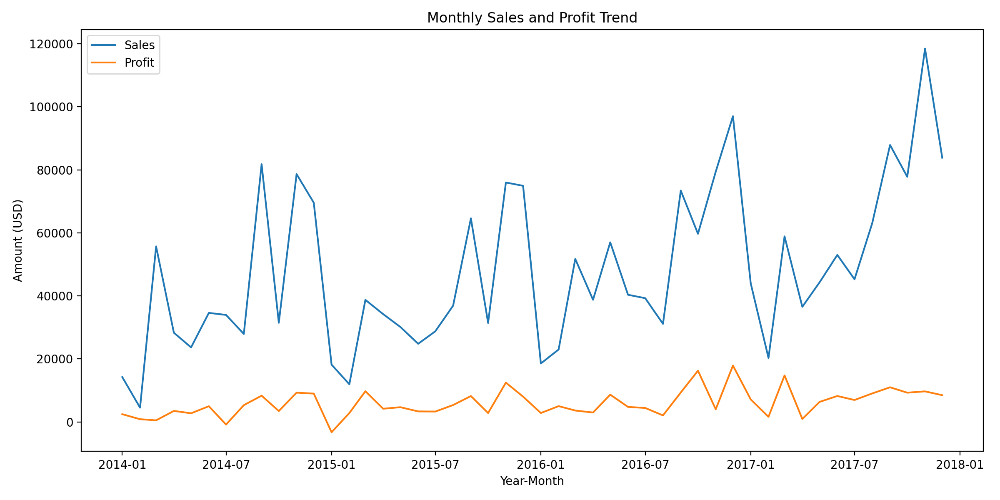
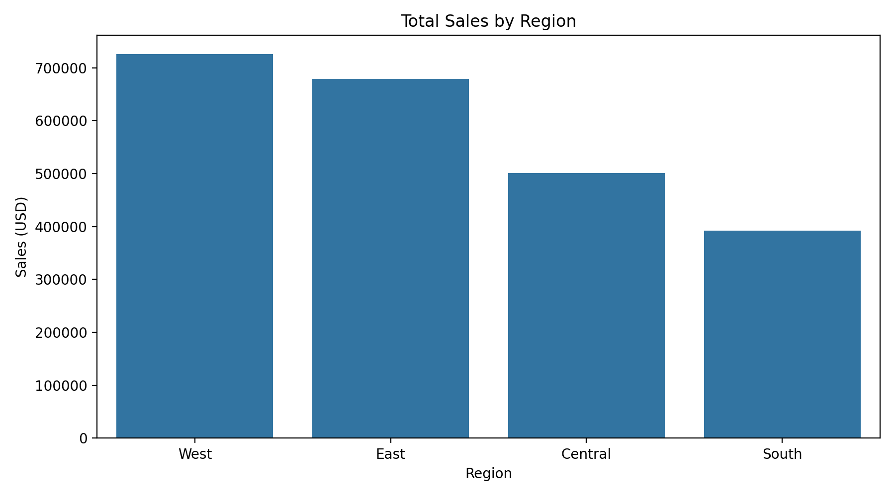
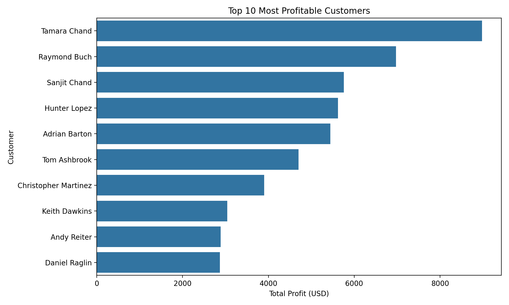

# Superstore Sales & Customer Profitability Analysis (SQLite)

A complete end-to-end SQL analytics project using the Superstore dataset.  
This project demonstrates practical skills in data cleaning, KPI analysis, customer segmentation, discount impact evaluation, and profitability insights.

---

# 📑 Table of Contents

1. [Project Overview](#project-overview)
2. [E-Commerce Sales Analysis](#E-Commerce-Sales-Analysis)  
3. [Objectives](#objectives)  
4. [Data Preparation](#data-preparation)
5. [How to Run ](#How-to-Run )
6. [Overall KPIs](#overall-kpis)  
7. [Yearly Performance](#yearly-performance)  
8. [Category Performance](#category-performance)  
9. [Monthly Sales & Profit Trend](#monthly-sales--profit-trend)  
10. [Regional Sales & Profit Analysis](#regional-sales--profit-analysis)  
11. [Top 10 Most Profitable Customers](#top-10-most-profitable-customers)  
12. [Unprofitable Customers Analysis](#unprofitable-customers-analysis)
13. [Final Note](#Final_Note)

---

# 📘 Project Overview

This SQL project performs a complete analysis of the Superstore dataset using **SQLite**.  
It evaluates sales trends, category profitability, customer behavior, discount effects, and regional performance.

The project highlights real-world Data Analyst capabilities including:

- SQL-based data cleaning  
- KPI development  
- Trend & segmentation analysis  
- Insight generation for business decisions  

---
# E-Commerce Sales Analysis

This project addresses the common business challenge of high sales volume with inconsistent profitability by identifying key drivers of profit and loss across customers, product categories, regions, and discount strategies.

---

# 🎯 Objectives

- Analyze **sales trends** over time  
- Identify **profitable vs. low-profit categories**  
- Segment customers based on **profitability**  
- Measure the **impact of discounts**  
- Compare **regional performance**  
---
# 🛠 Data Preparation

### **1. Convert date columns into ISO format (`YYYY-MM-DD`)**

The dataset originally contained dates in inconsistent formats (e.g., `11/8/2016`).  
They were transformed into ISO format so SQLite could process them correctly.

### **2. Create a clean view for analysis**
The table shows a cleaned sample of the dataset, with standardized date formats and additional derived columns for order year and order month.

---
## ▶️ How to Run

1. Import the CSV file into SQLite.
2. Run the cleaning SQL scripts.
3. Run the analysis SQL scripts.

---

# 📊 Overall KPIs

* **5,009 unique orders**
* **Total sales:** $2.30M
* **Total profit:** $286K
* **Overall profit margin:** ~12–13%

---

# 📈 Yearly Performance

| Year | Sales (USD) | Profit (USD) |
| ---- | ----------- | ------------ |
| 2014 | 484,247.50  | 49,543.97    |
| 2015 | 470,532.51  | 61,618.60    |
| 2016 | 609,205.60  | 81,795.17    |
| 2017 | 733,215.26  | 93,439.27    |

### **Insights**

* Revenue dipped slightly in 2015 vs. 2014, but profit rose.
* Sales and profit grew sharply in 2016 and 2017, showing positive momentum.

---

# 🛒 Category Performance

| Category        | Sales (USD) | Profit (USD) |
| --------------- | ----------: | -----------: |
| Technology      |  836,154.03 |   145,454.95 |
| Furniture       |  741,999.80 |    18,451.27 |
| Office Supplies |  719,047.03 |   122,490.80 |

### **Insights**

* Technology is the strongest category by a wide margin.
* Office Supplies also shows high profitability.
* Furniture generates high sales but minimal profit due to low margins.

---

# 📅 Monthly Sales & Profit Trend

| Year | Month | Year-Month | Sales (USD) | Profit (USD) |
|------|--------|------------|-------------|--------------|
| 2014 | 01     | 2014-01    | 14236.90    | 2450.19      |
| 2014 | 02     | 2014-02    | 4519.89     | 862.31       |
| 2014 | 03     | 2014-03    | 55691.01    | 498.73       |
| 2014 | 04     | 2014-04    | 28295.35    | 3488.84      |
| 2014 | 05     | 2014-05    | 23648.29    | 2738.71      |

### **Insights**

* **Q4 consistently delivers the highest revenue**, especially November and December.
* Profit does not always rise with sales due to discounting (especially in Q4).
* **Q1 is the weakest period**, reflecting post-holiday slowdown.
* Some months (e.g., **March, October**) show unusually high margins.
* Negative-profit months (e.g., **July 2014**, **Jan 2015**) highlight unprofitable discounting.
* **2017** is the strongest year overall.

---

# 🌎 Regional Sales & Profit Analysis

| Region  | Total Orders | Total Sales (USD) | Total Profit (USD) | Avg Discount | Profit Margin (%) |
|---------|--------------|-------------------|---------------------|--------------|--------------------|
| West    | 1611         | 725,457.82        | 108,418.45          | 0.1093       | 14.94              |
| East    | 1401         | 678,781.24        | 91,522.78           | 0.1454       | 13.48              |
| Central | 1175         | 501,239.89        | 39,706.36           | 0.2404       | 7.92               |
| South   | 822          | 391,721.91        | 46,749.43           | 0.1473       | 11.93              |

### **Insights**

* **West** leads all regions in revenue ($725K) and profit ($108K) with the highest margin (14.9%).
* **East** performs strongly but with slightly lower margins.
* **Central** suffers from high discounting (avg 24%) and the lowest margin (7.9%).
* **South** has the lowest revenue but healthier margins than Central.
* Strong negative correlation: **higher discount = lower margin**.
* **West + East = 60% of total revenue**.

---

# 🏆 Top 10 Most Profitable Customers

| Customer ID | Customer Name        | Total Sales (USD) | Total Profit (USD) | Order Count |
|-------------|-----------------------|--------------------|---------------------|-------------|
| TC-20980    | Tamara Chand          | 19,052.22          | 8,981.32            | 5           |
| RB-19360    | Raymond Buch          | 15,117.34          | 6,976.10            | 6           |
| SC-20095    | Sanjit Chand          | 14,142.33          | 5,757.41            | 9           |
| HL-15040    | Hunter Lopez          | 12,873.30          | 5,622.43            | 6           |
| AB-10105    | Adrian Barton         | 14,473.57          | 5,444.81            | 10          |
| TA-21385    | Tom Ashbrook          | 14,595.62          | 4,703.79            | 4           |
| CM-12385    | Christopher Martinez  | 8,954.02           | 3,899.89            | 4           |
| KD-16495    | Keith Dawkins         | 8,181.26           | 3,038.63            | 12          |
| AR-10540    | Andy Reiter           | 6,608.45           | 2,884.62            | 6           |
| DR-12940    | Daniel Raglin         | 8,350.87           | 2,869.08            | 8           |

### **Insights**

* **Tamara Chand** is the most profitable customer ($8,981 profit from 5 orders).
* Raymond Buch and Sanjit Chand also contribute strongly.
* Some frequent buyers (e.g., **Keith Dawkins**) generate low profit due to product mix or discounts.
* Profitability is not equal to revenue — discounts and category margins matter.
* Top 10 customers contribute **~17% of total company profit**.
* Valuable for CRM, loyalty programs, and pricing optimization.

---

# 🚨 Unprofitable Customers Analysis

| Customer ID | Customer Name     | Total Sales (USD) | Total Profit (USD) | Orders |
|-------------|-------------------|-------------------|---------------------|--------|
| CS-12505 | Cindy Stewart     | 5690.05 | -6626.39 | 6 |
| GT-14635 | Grant Thornton    | 9351.21 | -4108.66 | 3 |
| LF-17185 | Luke Foster       | 3930.51 | -3583.98 | 7 |
| SR-20425 | Sharelle Roach    | 3233.48 | -3333.91 | 5 |
| HG-14965 | Henry Goldwyn     | 3247.64 | -2797.96 | 12 |
| NC-18415 | Nathan Cano       | 2218.99 | -2204.81 | 6 |
| SB-20290 | Sean Braxton      | 8057.89 | -2082.75 | 7 |
| SM-20320 | Sean Miller       | 25043.05 | -1980.74 | 5 |
| CP-12340 | Christine Phan    | 5888.27 | -1850.30 | 8 |
| NF-18385 | Natalie Fritzler  | 8322.83 | -1695.97 | 7 |

### **Insights**

* **Cindy Stewart** is the most unprofitable customer (–$6,626 loss).
* Several others (e.g., **Grant Thornton**, **Luke Foster**) produce significant losses.
* High-frequency customers with negative profit (e.g., **Henry Goldwyn**, **Zuschuss Carroll**) are structurally unprofitable.
* Some customers generate high sales but negative profit → discount-heavy transactions.
* Negative-profit customers collectively account for **over –$70K in loss**.
* Indicates need for improved discount strategy and targeted segmentation.

---

## ✅ Final Note

**This analysis identifies cases where high sales do not translate into profit and provides actionable insights to improve pricing, discount, and customer strategies.**

